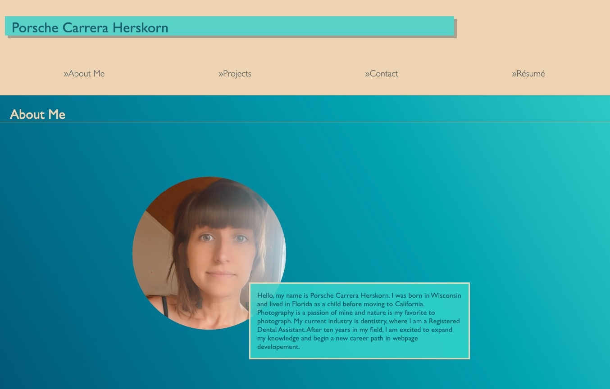

<h1 align="center">Greetings, my name is Porsche Herskorn</h1>
<h3 align="center">Registered Dental Assistant → Full-Stack Software Developer</h3>

    <a href="mailto:herskorn@gmail.com">Email</a> | <a href="https://www.linkedin.com/in/porsche-herskorn/">LinkedIn</a> | <a href="https://porsche-folio.netlify.app/">Portfolio</a> | <a href="https://www.instagram.com/eepitsporsche/">Instagram</a>
    

Hello, my name is Porsche Carrera Herskorn. I was born in Wisconsin and lived in Florida as a child before moving to California. Photography is a passion of mine and nature is my favorite subject to photograph. My current industry is dentistry, where I am a Registered Dental Assistant. After ten years in my field, I am excited to expand my knowledge and begin a new career path in webpage developement, and am currently seeking a full-time position as a junior developer.

- 📖 I’m currently building my portfolio through my work via the Full-Stack Web Development Boot Camp at the UC Berkeley Extension.
- 💻 The tech stack I’m currently learning ...
  - Browser-based technologies: HTML, CSS, JavaScript, jQuery, Responsive Design, Bootstrap, Progressive Web Applications (PWAs), Local Storage, Session Storage, IndexedDB, React.js
  - API Design: Client-Server Model API, REST, JSON, AJAX (Fetch API), HTTP request methods, GraphQL
  - Databases: MySQL, MongoDB
  - Deployment and Delivery: Heroku, Git, GitHub Pages, Shell Scripting, Unit Testing, Linting, Continuous Integration
  - Server Side Development: Node.js, Express.js, User Authentication, Template Engines, MERN Stack
  (MongoDB, Express.js, React.js, Node.js)
  - Tools: VS Code, Command Line
  - Computer science applied to Javascript: Algorithms (Searches, Sorts), Performance, Time Complexity, Big O Notation, Data Structures, Design Patterns

<h1 align="center">Projects</h1>
<table bordercolor="#087b95">

<tr>
<td width="50%" valign="top">
  <h3 align="center">Dev Gab</h3>
   
  
   
  

  <a href="https://github.com/eepitsporsche/dev_gab" target="_blank">
  Repository
  </a> | 
  <a href="https://dev-gab-4b3f57fe0b27.herokuapp.com" target="_blank">
  Live Page
  </a>
  

  
<strong>A CMS style blog site that follows the MVC paradigm in its architectural structure, uses Handlebars.js as the templating language, Sequelize as the ORM, and the express-session npm package for authentication.

</td>
<td width="50%" valign="top">
<h3 align="center">Personal Portfolio v1</h3>
 

 

<a href="https://github.com/eepitsporsche/porsche_herskorn_portfolio_webpage" target="_blank">
Repository
</a> | 
<a href="https://eepitsporsche.github.io/porsche_herskorn_portfolio_webpage/" target="_blank">
Live Page
</a>

<strong>A JavaScript application to generate random passwords utilizing selected criteria.

</td>
</tr>

<tr>
<td width="50%" valign="top">
<h3 align="center">5-Day Weather Widget</h3>
 

 

<a href="https://github.com/eepitsporsche/5_day_forecast_weather_widget" target="_blank">
Repository
</a> | 
<a href="https://eepitsporsche.github.io/5_day_forecast_weather_widget/" target="_blank">
Live Page
</a>

<strong>A weather dashboard that runs in the browser and features dynamically updated HTML and CSS.

</td>
<td width="50%" valign="top">
<h3 align="center">Timed Coding Assessment Quiz</h3>
 

 

<a href="https://github.com/eepitsporsche/timed_coding_assessment_quiz" target="_blank">
Repository
</a> | 
<a href="https://eepitsporsche.github.io/timed_coding_assessment_quiz/" target="_blank">
Live Page
</a>

<strong>A timed quiz on JavaScript fundamentals that utilizes local storage to store high scores.

</td>
</tr>
</table>
